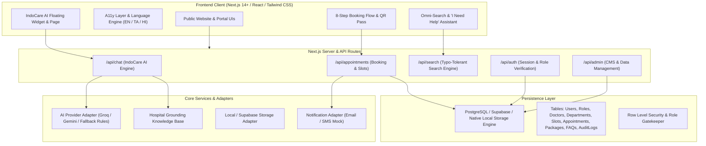

# Indo States Health – Technical Architecture & System Design

## 1. High-Level Architecture

The Indo States Health platform is architected as an enterprise-grade full-stack web application designed for high availability, low latency, robust data protection, and seamless multi-channel patient interaction.



---

## 2. Core Technology Choices

1. **Framework:** Next.js with App Router, TypeScript, React 18/19.
2. **Styling & Design System:** Tailwind CSS with custom healthcare tokens (calm slate, clinical navy, cyan vitality, emerald healing, crimson alert), accessible focus states, and zero unnecessary layout shifts.
3. **Icons:** Lucide React (accessible, clean medical and system iconography).
4. **Validation:** Zod schemas for client and server input sanitization.
5. **State & Storage Strategy:**
   * Hybrid state layer: Operates in full offline/development mode using a robust client/server store with initial seeded data (verified doctors, verified packages, diagnostic modalities).
   * Fully configurable for live Supabase PostgreSQL + Auth with environment variables.
6. **IndoCare AI Engine:**
   * Grounded Retrieval-Augmented Generation (RAG) over verified Indo States Health knowledge base.
   * Safety guardrails preventing medical diagnoses or prescriptions.
   * Built-in multi-lingual capability (English, Tamil, Hindi).
   * Graceful fallback to hospital FAQs and direct telephone triage (`0422-2111000`) if external LLM quotas or keys are absent.

---

## 3. Database Entity Design (PostgreSQL / Supabase Ready)

```sql
-- Core Entities Schema

CREATE TABLE roles (
    id TEXT PRIMARY KEY,
    name TEXT NOT NULL -- 'patient', 'doctor', 'admin'
);

CREATE TABLE users (
    id TEXT PRIMARY KEY DEFAULT gen_random_uuid(),
    email TEXT UNIQUE NOT NULL,
    phone TEXT,
    full_name TEXT NOT NULL,
    role_id TEXT REFERENCES roles(id) DEFAULT 'patient',
    created_at TIMESTAMP WITH TIME ZONE DEFAULT NOW()
);

CREATE TABLE departments (
    id TEXT PRIMARY KEY,
    name TEXT NOT NULL,
    slug TEXT UNIQUE NOT NULL,
    description TEXT NOT NULL,
    icon TEXT,
    head_of_department TEXT
);

CREATE TABLE doctors (
    id TEXT PRIMARY KEY,
    full_name TEXT NOT NULL,
    qualifications TEXT NOT NULL,
    specialization TEXT NOT NULL,
    department_id TEXT REFERENCES departments(id),
    biography TEXT NOT NULL,
    avatar_url TEXT,
    consultation_fee NUMERIC DEFAULT 500,
    available_days TEXT[], -- ['Monday', 'Wednesday', 'Friday']
    is_active BOOLEAN DEFAULT TRUE
);

CREATE TABLE health_packages (
    id TEXT PRIMARY KEY,
    name TEXT NOT NULL,
    slug TEXT UNIQUE NOT NULL,
    price NUMERIC NOT NULL,
    description TEXT NOT NULL,
    included_tests JSONB NOT NULL,
    preparation_instructions TEXT,
    is_popular BOOLEAN DEFAULT FALSE
);

CREATE TABLE appointment_slots (
    id TEXT PRIMARY KEY DEFAULT gen_random_uuid(),
    doctor_id TEXT REFERENCES doctors(id),
    department_id TEXT REFERENCES departments(id),
    slot_date DATE NOT NULL,
    start_time TIME NOT NULL,
    end_time TIME NOT NULL,
    is_booked BOOLEAN DEFAULT FALSE
);

CREATE TABLE appointments (
    id TEXT PRIMARY KEY DEFAULT gen_random_uuid(),
    reference_code TEXT UNIQUE NOT NULL,
    patient_id TEXT REFERENCES users(id),
    doctor_id TEXT REFERENCES doctors(id),
    department_id TEXT REFERENCES departments(id),
    package_id TEXT REFERENCES health_packages(id),
    slot_date DATE NOT NULL,
    slot_time TEXT NOT NULL,
    patient_name TEXT NOT NULL,
    patient_email TEXT NOT NULL,
    patient_phone TEXT NOT NULL,
    patient_age INTEGER,
    patient_gender TEXT,
    symptoms_notes TEXT,
    status TEXT DEFAULT 'confirmed', -- 'pending', 'confirmed', 'completed', 'cancelled'
    payment_status TEXT DEFAULT 'pay_on_visit', -- 'pay_on_visit', 'paid_online'
    created_at TIMESTAMP WITH TIME ZONE DEFAULT NOW()
);

CREATE TABLE ai_knowledge_sources (
    id TEXT PRIMARY KEY DEFAULT gen_random_uuid(),
    category TEXT NOT NULL,
    title TEXT NOT NULL,
    content TEXT NOT NULL,
    keywords TEXT[]
);

CREATE TABLE audit_logs (
    id TEXT PRIMARY KEY DEFAULT gen_random_uuid(),
    user_id TEXT,
    action TEXT NOT NULL,
    resource TEXT NOT NULL,
    metadata JSONB,
    created_at TIMESTAMP WITH TIME ZONE DEFAULT NOW()
);
```

---

## 4. Security & Privacy Framework

* **Zero Hardcoded Secrets:** All external API endpoints and keys are loaded via environment variables (`.env.local`).
* **Medical Disclaimer Enforcement:** AI output always renders standard clinical warning banners reminding patients that IndoCare AI is an educational assistant, not an emergency diagnosis service.
* **Input Sanitization:** Strong Zod schema validation across all form inputs (name, phone, appointment date, feedback) to prevent injection and XSS.
* **Double-Booking Prevention:** Slot assignment verifies both optimistic and database-level unique locking constraints.
