# Indo States Health – Comprehensive Sitemap & Information Architecture

This document defines the complete URL structure, route hierarchy, and access control for the Indo States Health web application.

```mermaid
graph TD
    Root["/ (Home)"]
    Root --> About["/about (About Indo States)"]
    Root --> Vision["/vision-mission (Vision & Mission)"]
    Root --> Team["/leadership (Leadership & Team)"]
    Root --> Doctors["/doctors (All Doctors)"]
    Doctors --> DocProfile["/doctors/[id] (Doctor Detail Profile)"]
    Root --> Depts["/departments (All Departments)"]
    Depts --> DeptDetail["/departments/[slug] (Department Details)"]
    Root --> PrevHealth["/preventive-health (Preventive Health Center)"]
    Root --> Diag["/diagnostic-center (Diagnostic Center)"]
    Diag --> MRI["/diagnostic-center/mri (MRI 1.5 Tesla)"]
    Diag --> CT["/diagnostic-center/ct (128-Slice CT)"]
    Diag --> DEXA["/diagnostic-center/dexa (DEXA Bone & Body Scan)"]
    Diag --> Mammo["/diagnostic-center/mammography (3D Mammography)"]
    Diag --> Lab["/diagnostic-center/laboratory (Pathology & Lab)"]
    Root --> Packages["/health-packages (Health Packages & Master Checkup)"]
    Root --> PatientInfo["/patient-info (Visitor & Patient Guidance)"]
    Root --> Emergency["/emergency (Emergency & Ambulance Support)"]
    Root --> Contact["/contact (Contact Us & Direct Inquiry)"]
    Root --> Directions["/find-us (Directions, Maps & Campus)"]
    Root --> Charity["/charity (ARDOR Care Foundation)"]
    Root --> Careers["/career (Careers & Openings)"]
    Root --> FAQ["/faq (Frequently Asked Questions)"]
    Root --> Assistant["/assistant (IndoCare AI Dedicated Guide)"]
    Root --> Booking["/book-appointment (Multi-Step Booking Engine)"]
    Root --> Auth["/login & /register (Secure Authentication)"]
    Auth --> PatientPortal["/portal/patient (Patient Dashboard)"]
    Auth --> DoctorPortal["/portal/doctor (Doctor Schedule & Queue)"]
    Auth --> AdminPortal["/portal/admin (Administrative Management)"]
    Root --> Legal["/privacy-policy, /terms, /accessibility"]
```

## Detailed Route Map

### 1. Public & Institutional Pages
* `/` – Flagship Homepage (Hero, Urgent Actions, Specialties, Technology, Packages, Verified Doctors, Testimonials, Quick Contact)
* `/about` – Overview of Indo States Health, philosophy, and history
* `/vision-mission` – Detailed Vision, Mission, and Core Institutional Values
* `/leadership` – Executive Board, Clinical Leadership, and Management Bios
* `/charity` – ARDOR Care Foundation & Ardor Corporation USA (Section 80G & 501(c)(3) aid)
* `/career` – Careers, Hospital Culture, and Application Submission

### 2. Clinical Care & Diagnostic Centers
* `/doctors` – Directory of certified consultants, specializations, search & filter
* `/doctors/[id]` – Dedicated doctor profile with verified credentials, bio, and direct booking CTA
* `/departments` – Full list of clinical departments (Radiology, Emergency Medicine, Cardiology, Neurology, Obstetrics & Gynecology, General Surgery, Pathology)
* `/departments/[slug]` – Individual department deep-dive with procedures and doctors
* `/preventive-health` – Preventive Health Center (Primary to Quaternary Prevention, 10 Health Pillars)
* `/diagnostic-center` – Advanced Diagnostic Modalities Hub
* `/diagnostic-center/mri` – 1.5 Tesla High-Field MRI procedures (Contrast & Non-contrast)
* `/diagnostic-center/ct` – 128-Slice Ultra-Fast CT Scanner (Low Dose CT, Angiography)
* `/diagnostic-center/dexa` – DEXA Bone Mineral Density (BMD) & Body Fat Scan
* `/diagnostic-center/mammography` – High-Resolution 3D Digital Mammography
* `/diagnostic-center/laboratory` – Pathology, Biochemistry, Hormone Profiles, and Free Home Collection
* `/health-packages` – Master Health Check-up (₹3,500) and specialized screening packages

### 3. Patient Services & Booking
* `/book-appointment` – 8-Step Appointment Booking Engine with instant confirmation & QR pass
* `/patient-info` – Patient Rights, Pre-Test Preparation (fasting instructions), Insurance & Billing
* `/emergency` – Emergency Care Hotline (`0422-2111000`), Ambulance info, Triage guidelines
* `/contact` – Contact details, hours, inquiry form, feedback
* `/find-us` – Campus map, driving directions from Coimbatore Airport & Railway Station, landmark details
* `/faq` – Searchable repository of hospital queries, test prerequisites, and visiting rules
* `/assistant` – Dedicated full-screen IndoCare AI assistant

### 4. Authenticated Portals
* `/login` & `/register` – Role-aware authentication (Patient, Doctor, Admin)
* `/portal/patient` – Patient Dashboard: Upcoming Appointments, Pass Download, History, Reschedule/Cancel, Family Accounts, Profile
* `/portal/doctor` – Doctor Dashboard: Today's Appointments Queue, Patient Records Overview, Schedule Availability
* `/portal/admin` – Hospital Administration Dashboard: Doctor management, Department CRUD, Package updates, FAQ management, AI Knowledge Base management, Audit logs

### 5. Compliance & Trust
* `/privacy-policy` – Healthcare Privacy and Data Protection compliance
* `/terms` – Terms of Service and digital care conditions
* `/accessibility` – Accessibility Statement & WCAG conformance details
